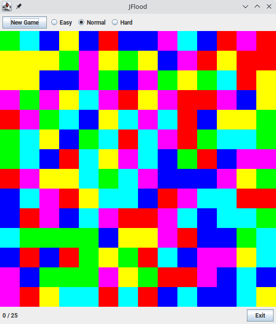

# JFlood
Just another flood it clone written in Java.



## Build
```
git clone https://github.com/MichaelStraube/jflood.git
cd jflood
ant
```
## Run
```
cd bin
java -jar JFlood.jar
```
## Play
Click on a square to choose a color.
